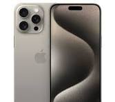

# Apuntes día 10

Colocar javaScript en html
```html
<script></script>

```
Colocar alertas en java Script
```js

alert("Hola mundo")
```
Agregar mas contenido a un html
```js
 // 1. Seleccionar el Div a modificar
        const mainDiv = document.querySelector(".mainContent");

 // 2. Crear un HTMl
        const fila = ` 
        <div class="content-2-3">
            <div class="content2 item">Content 2</div>
            <div class="content3 item">Content 3</div>
        </div>`;

// 3. Agregar la caja fila dentro de mainContent
        mainDiv.innerHTML += fila;
        mainDiv.innerHTML += fila;
        mainDiv.innerHTML += fila;
```

Colocar una variable como texto en un script

```js
const numero = 25;
const fila = `<div> Contenido ${numero}</div>`
```

# Sistema responsive de sitios web

## Media Queries!
 declaracion en CSS que permite definir los estilos de nuestra web.

 ## Sintaxis de una MQ
  Una Media Query se compone de multiples partes:
  - un @media es una palabra clave reservada.
  - un tipo de media (screen, print, all, speech) [Media Type]
  - Operaciones (and, not, only)
  - Breakpoint una condición (max-width, min-width, etc)
  - un bloque de CSS

```css
/* @media  screen  and  (breakpoint) { } */

body{
    background-color:lightgreen;
}

@media screen and (min-width: 600px) 
{
    body { 
        background-color:lightblue;
        }
}
```
## Combinación de breakpoints

```css

@media screen and (min-width:600px) and (max-width:800px){
    body{
        background-color:lightblue;
    }
}

/* Orientacion del dispositivo (landscape vs portarit) */

@media screen and (orientation: landscape){
    body{
        color:green;
    }
}

/* Modo Obscuro */
@media screen and (prefers-color-schema: dark){
    body{
        background-color:black;
        color:white
    }
}

```

## Media
- all: todos los dispositivos
- print: vista previa de impresión
- screen: pantallas a color(tablets,moviles,ordenadores)
- speech: dispositivos que conviertan texto a voz.

- otros elementos despreciados: tv, handheld, braille, etc. (no funciona mas en css3)

```css

@media print {
    .no-print{
        display: none;
    }
}
```

## Tips para utilizarlo

- Siempre sobreescriben las reglas de CSS normales pero no poseen mejor especificidad. Por lo que los media queries deben de ir al final de nuestro CSS.

- Deben  utilizar el mismo selector y la misma regla para que se reemplace la propiedad que deseamos.

- Pensar de antemanos que tipo de pantalla quiero ocupar para que elementos.

- Intentemos desarrollar siempre primero para el movil(mobile first!).

- Podemos utiliar @media para cada selector o una sola para todos los selectores.(la ultima es la recomendada).

Ejempo de una @media para todos los selectores.

```css
.box {}
.p{}

/* pantalla mediana */
@media screen and (min-width: 1024px){
    .box{}
    .p{}
}
/* pantalla grande */
@media screen and (min-width: 2048){
    .box{}
    .p{}
}
```

Hacer medias querys con Picture

```html
<picture>
<source media="(min-width:1024px)" srcset="./img/descktop.jpeg">
<source media="(min-width:650px) " srcset="./img/tablet.jpeg">

</picture>
```

## Mobile Vs Tablets Vs Desktop

Actualizados al 2024

- Mobile: 320px - 480px / 1440 x 3200px
- Tablet: 768px - 1024pxm / 2560 x 1600px
- Desktop: 1024px - 1920px / 5120 x 2880px

